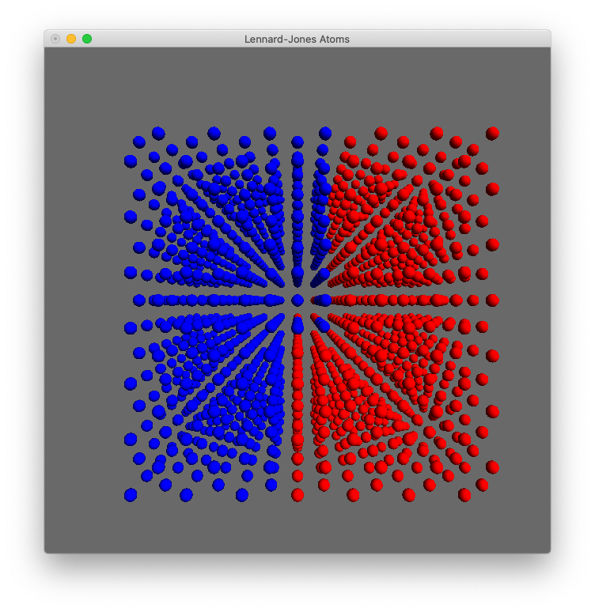
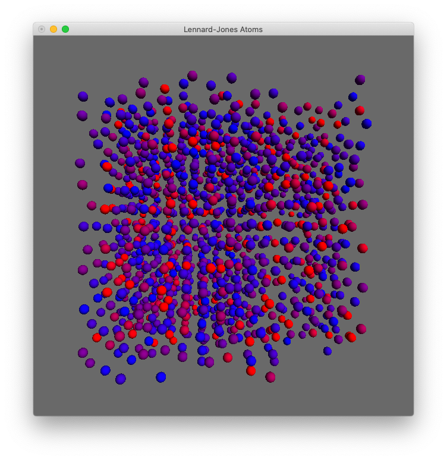

# Thermal Equilibration Visualization

Visualize thermal equilibration using OpenGL.

## Build (for macOS)

```
make
./mdv < md.in
```

## Project Description

The most important changes can be found in [d6b0be5](https://github.com/koucyuu/ThermalEquilibration/commit/d6b0be5c7d6a0e4ca5334d1e9278c13933f3f87e).

### Initialization

Initialize half the MD box at a high temperature and the other half at a low temperature.

Color-coding the atoms according to their kinetic-energy values.



### Result

Temperatures will equilibrate.



### Video demonstration


## Credits and References

* [aiichironakano/SimpleMD](https://github.com/aiichironakano/SimpleMD) for code bases to start with
